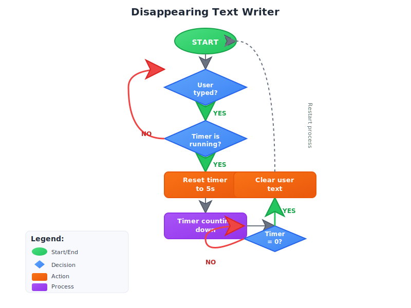

# Disappearing Text Writer

A desktop text editor app with a disappearing text feature based on user inactivity, built with Python and Tkinter.

## Overview

This application provides a simple text editor where the user can type freely. A countdown timer starts after the user begins typing. If the user stops typing and the timer reaches zero, the entire text content is automatically cleared. The timer resets to 5 seconds every time the user types.

## Features

- Simple and clean GUI using Tkinter.
- Countdown timer displayed in the top-right corner.
- Timer starts only after the first keystroke.
- Automatic text clearing after 5 seconds of inactivity.
- Modular design with timer logic separated into its own module.
- Visual flowchart illustrating the app’s logic.

## Installation

1. Ensure you have Python 3.7+ installed.
2. Clone this repository or download the source code.
3. No external dependencies are required beyond the Python standard library.

## Usage

Run the main application:

```bash
python main.py
```

Start typing in the text area. The timer will appear and count down from 5 seconds. If you stop typing and the timer reaches zero, the text will be cleared automatically.

## Project Structure

- `main.py`: Main application file containing the GUI and app logic.
- `timer.py`: Module containing the CountdownTimer class managing the countdown logic.
- `flowchart.svg`: Flowchart diagram illustrating the timer system logic.
- `README.md`: This documentation file.

## Flowchart

The flowchart (`flowchart.svg`) visually represents the app’s logic, including user typing detection, timer running, countdown, and text clearing.


